# Classification of hair_loss dataset by machine-learning-methods

## Description
In this project a labeled dataset about hair loss intensity is used to train machine-leaning-models for classification. 
The goal is to create a model which can predict with new datasets how severe the hair loss is of that person is.

## Installation
Install dependencies according to the requirements.txt file. Alternatively use pip or conda to install.
### pip
pip can be used to install the dependencies by using following bash command:  
```bash
pip install -r requirements.txt
```
### conda
```bash
conda create --name new_environment_name --file requirements.txt
```


## Usage
The code is written in Jupyter notebooks. Jupyter is required to work with this project.  
After running the necessary cells in the notebooks, explore the results, visualizations, and any additional information provided in the notebooks.

## Data
The Dataset 100000 labeled samples with 10 attributes. It is complete. No datapoints are missing and no datapoints are NaN.  
The features are: total_protein,
total_keratine,
hair_texture,
vitamin,
manganese,
iron,
calcium,
body_water_content,
stress_level and
liver_data.  
The labels are hair loss intensity between 0 no hair loss and 5 strong hair loss. The distribution of class labels is even.


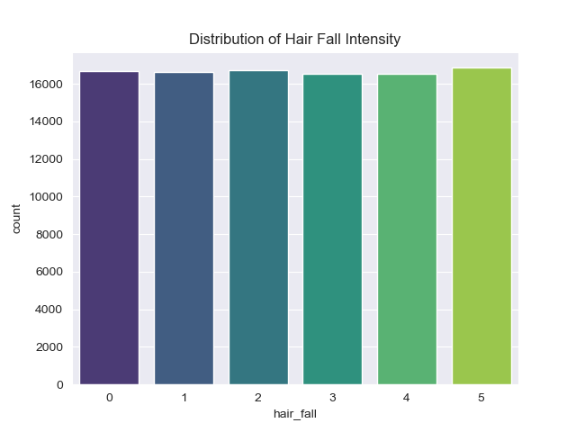

The following boxplots show that the values of all features are almost the same distributed across all hair loss levels.
Mean, median and quantils are the same on all hair loss severities. No obvious pattern or trend can be identified by eye.  
There are 2 classes of features. The values of body_water_content, hair_texture and stess_level fall between 0 and 100.
Other features range between 0 and 500.

<div style="display: flex; justify-content: space-between;">
    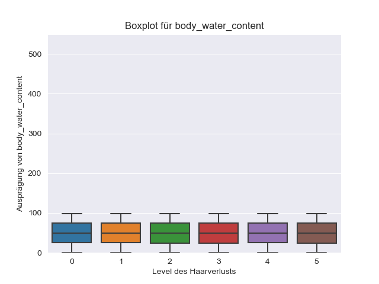
    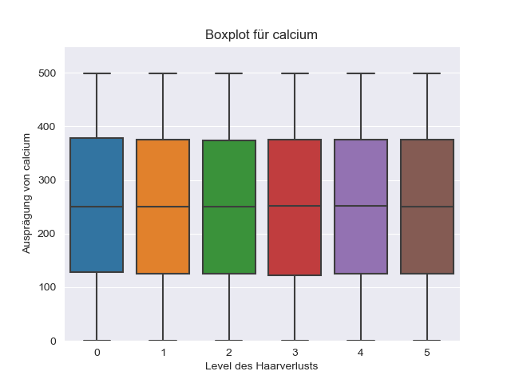
</div>

<div style="display: flex; justify-content: space-between;">
    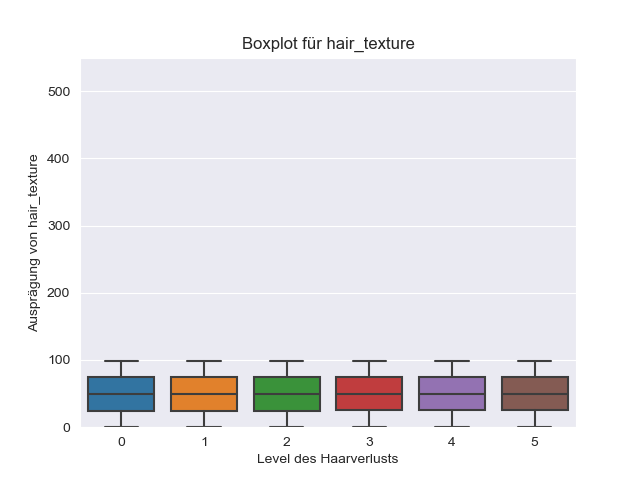
    
</div>

<div style="display: flex; justify-content: space-between;">
    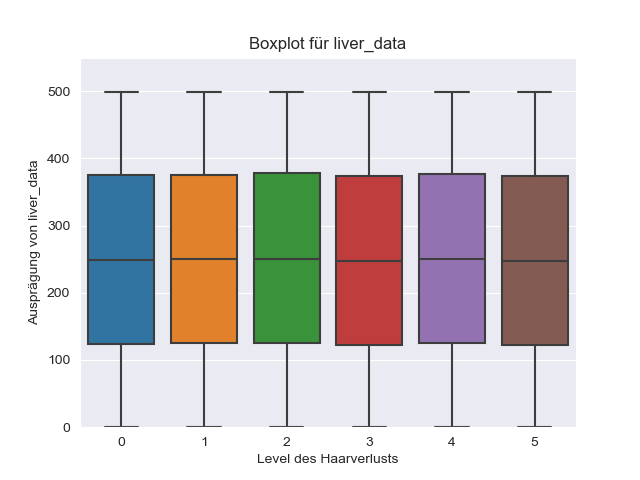
    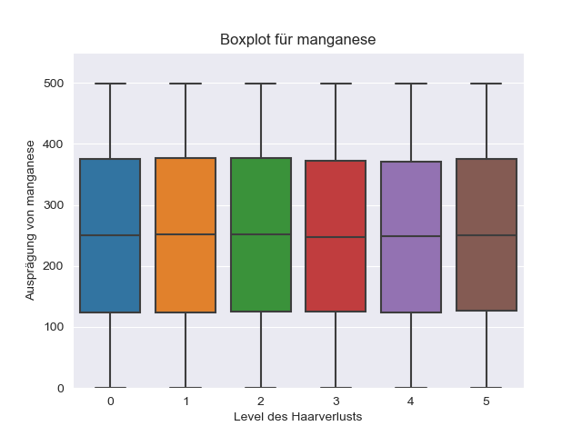
</div>

<div style="display: flex; justify-content: space-between;">
    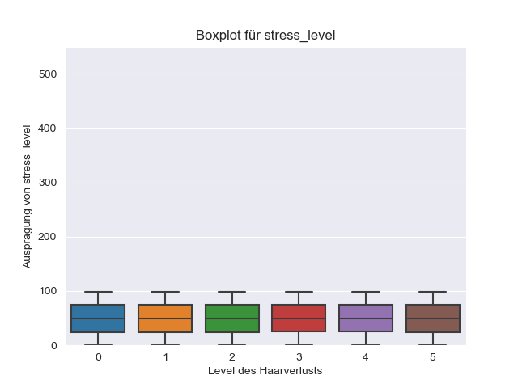
    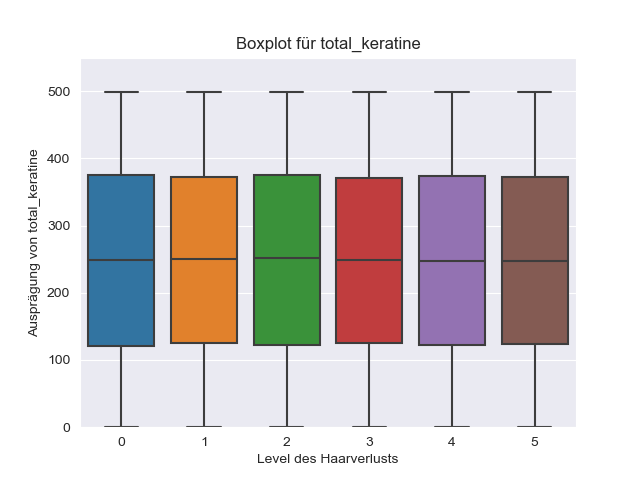
</div>

<div style="display: flex; justify-content: space-between;">
    
    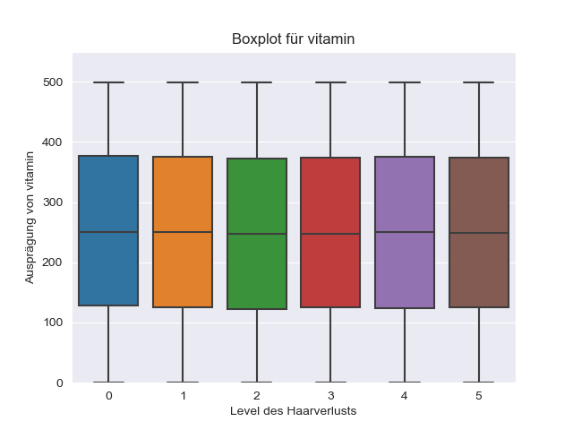
</div>

The features show no significant correlation to each other which is visualized by a correlation heat map. The pairplot illustrates
this as well. The Dataset was filtered by hair_loss=0 and hair_loss=5 for clarity. In the diagonal you can see the Kernel Density Estimate (KDE).It is a way to estimate the probability density function of a random variable. It involves placing a kernel (a smooth, symmetric function) on each data point and summing them to create a smooth curve, providing a non-parametric representation of the data's distribution.
Other elements are the pairplots.
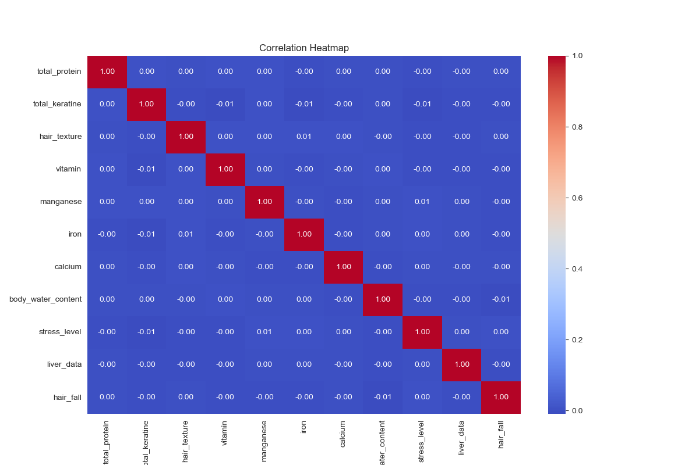


## Model Training
Several different methods were tested to achieve a classification. In all Models the features were z-normalized.
## Z-Normalization

Z-normalization, also known as standardization, is a preprocessing technique commonly used in machine learning to standardize the scale of numerical features. The process involves transforming the data so that it has a mean of 0 and a standard deviation of 1.

#### Formula

The formula for z-normalization is given by:

\[ z = \frac{{x - \mu}}{{\sigma}} \]

Where:
- \( x \) is the original value of a data point.
- \( \mu \) is the mean of the feature.
- \( \sigma \) is the standard deviation of the feature.


### Random Forest Classifier
Use Jupyter hairloss_RandFor.ipynb.  
Because the data is not well seperated linear classifiers were not used.  
Decision Tree classifiers should work better with bad seperated data.
it was decided to use a Random Fores Classifier. GridSearchCV was used to find the 
optimal Hyperparameter combination. A cross validation fold of 3 was used. The evaluation metric was accuracy.

#### Parameter Grid for Hyperparameter Tuning

- **n_estimators:**
  - 100
  - 500

- **max_depth:**
  - 5
  - 10
  - 20

- **min_samples_split:**
  - 2
  - 5
  - 10

- **min_samples_leaf:**
  - 1
  - 2
  - 4

- **max_features:**
  - 'sqrt'
  - 'log2'

- **criterion:**
  - 'gini'
  - 'entropy'

Additionally, Ordinary Least Squares (OLS) Regression in Statsmodels was used to see whether interaction terms could lead to a korrelation.
All interaction terms were computed and analyzed by OLS. If the resulting p-Value was below 0.1 there could be a significance.
Those interaction terms were used as additional features for classification with Random Forest.
### Principal Component Analysis
Use Jupyter hairloss_pca_RandFor.ipynb.  
Principal Component Analysis is a dimensionality reduction technique commonly used in machine learning to transform high-dimensional data into a lower-dimensional representation while preserving important information. In this example, PCA is applied to both the training and test datasets.
### Linear Discriminant Analysis
Use Jupyter hairloss_LDA_RandFor.ipynb.  
Linear Discriminant Analysis (LDA) is a dimensionality reduction technique commonly used in classification tasks to project high-dimensional data into a lower-dimensional space while maximizing class separability.
The reduced data is classified by Random Forest Classifier.
### Deep learning Feed Forward Neural Network
Use Jupyter hairloss_deeplearn.ipynb.  
A sequential feed forward deep learning neural network was tried for the classification. To train the model, a neural network architecture was defined using the Keras library. The model consists of a sequential stack of layers:  
- The first layer has 64 units with a ReLU activation function, taking input data of dimension 10.
- A Dropout layer is added to reduce overfitting with a dropout rate of 0.5.
- The second layer has 32 units with a ReLU activation function.
- The final layer has 6 units with a softmax activation function for multi-class classification.
- The model is compiled using categorical crossentropy as the loss function, the Adam optimizer, and accuracy as the evaluation metric:
- hyperparameters epochs=100 and batch_size=32 are used

Use Jupyter hairloss_deeplearn_2.ipynb.  
A second design was tried with more layers:
- The first layer has 128 units with a ReLU activation function, taking input data of dimension 10.
- A Dropout layer is added to reduce overfitting with a dropout rate of 0.5.
- Two 64 unit layers are added with a ReLU activation funciton.
- The second to last layer is has 32 units with a Relu activation function.
- The final layer has 6 units with a softmax activation function for multi-class classification.
- The model is compiled using categorical crossentropy as the loss function, the Adam optimizer, and accuracy as the evaluation metric:
- hyperparameters epochs=100 and batch_size=32 are used

#### Categorical Crossentropy

Categorical Crossentropy is a loss function commonly used in classification tasks where the output can belong to multiple classes. Specifically designed for multi-class classification problems, it measures the dissimilarity between the true distribution and the predicted distribution.

In the context of neural networks and deep learning, categorical crossentropy is suitable when the target variable is one-hot encoded. This means that each sample is represented as a vector with a 1 in the corresponding class and 0s in all other classes.

The formula for categorical crossentropy for a single sample is given by:

\[ L(y, \hat{y}) = - \sum_{i} y_i \cdot \log(\hat{y}_i) \]

Where:
- \( L(y, \hat{y}) \) is the categorical crossentropy loss.
- \( y_i \) is the true probability distribution (1 for the correct class, 0 otherwise).
- \( \hat{y}_i \) is the predicted probability distribution.

#### Adam Optimizer

Adam (short for Adaptive Moment Estimation) is an optimization algorithm commonly used for training deep neural networks. It combines the benefits of two other popular optimization techniques: RMSprop and Momentum.

##### Key Features:

1. **Adaptive Learning Rates:**
   Adam adjusts the learning rates of each parameter individually based on historical gradients. This adaptiveness helps converge faster and handle sparse gradients.

2. **Momentum:**
   Adam incorporates momentum, which helps accelerate the convergence by accumulating a weighted moving average of past gradients. This helps the optimizer continue in the same direction when the gradient changes direction.

3. **Root Mean Square Propagation (RMSprop):**
   The algorithm also utilizes RMSprop to normalize the learning rates. It divides the learning rate for a weight by the square root of the sum of squared gradients for that weight.

##### Formula:

The update rule for the parameters \( \theta \) in Adam is given by:

\[ m_t = \beta_1 \cdot m_{t-1} + (1 - \beta_1) \cdot g_t \]
\[ v_t = \beta_2 \cdot v_{t-1} + (1 - \beta_2) \cdot g_t^2 \]
\[ \hat{m}_t = \frac{m_t}{1 - \beta_1^t} \]
\[ \hat{v}_t = \frac{v_t}{1 - \beta_2^t} \]
\[ \theta_{t+1} = \theta_t - \frac{\text{learning rate} \cdot \hat{m}_t}{\sqrt{\hat{v}_t} + \epsilon} \]

Where:
- \( m_t \) and \( v_t \) are the first and second moments of the gradients.
- \( \beta_1 \) and \( \beta_2 \) are exponential decay rates (typically close to 1).
- \( g_t \) is the gradient at time \( t \).
- \( \epsilon \) is a small constant to avoid division by zero.


## Evaluation
All Methods were evaluated by the classification_report of sklearn. It calculates precision, recall,  f1-score, support and accuracy.
To get a better understanding of classification mistakes a confusion matrix is generated.
Note that guessing has an avarage accuracy of 0.167 (1/6).

### Metrics in the Classification Report:
- Precision:
Precision is the ratio of true positive predictions to the total predicted positives. It measures the accuracy of the positive predictions.
- Recall (Sensitivity):
Recall is the ratio of true positive predictions to the total actual positives. It measures the model's ability to capture all positive instances.
- F1-Score:
The F1-Score is the harmonic mean of precision and recall. It provides a balanced measure that considers both false positives and false negatives.
- Support:
Support represents the number of actual occurrences of each class in the specified dataset.
- Accuracy:
Accuracy is the ratio of correctly predicted instances to the total instances. While provided separately in the classification report, it is not a class-specific metric.
## Results
### Random Forest Classifier
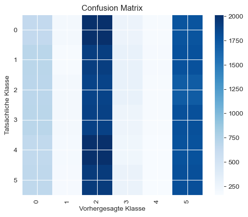
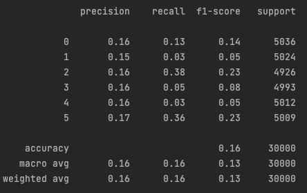

Interaktionsterm: total_protein * stress_level
p-Wert: 0.0241

Interaktionsterm: manganese * liver_data
p-Wert: 0.0626

Interaktionsterm: stress_level * liver_data
p-Wert: 0.0986
<div style="display: flex; justify-content: space-between;">
    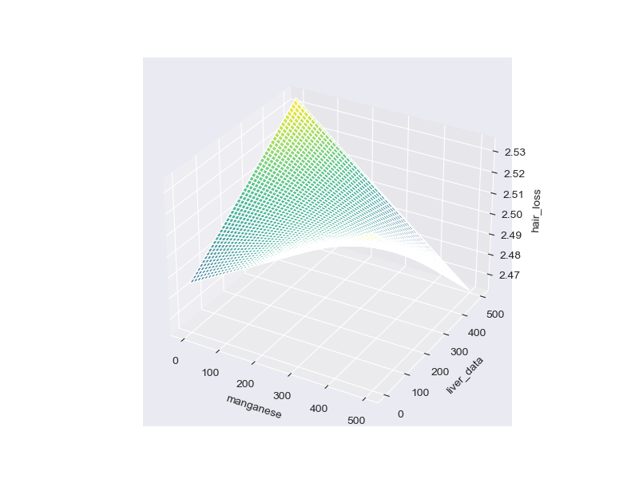
    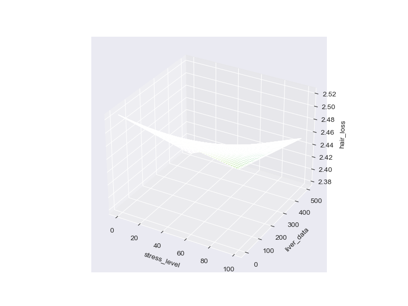
    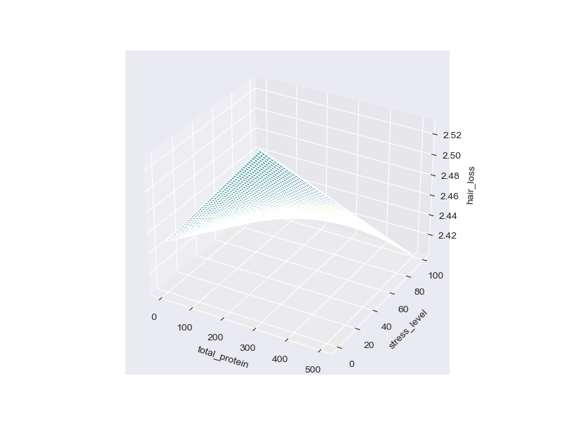
</div>

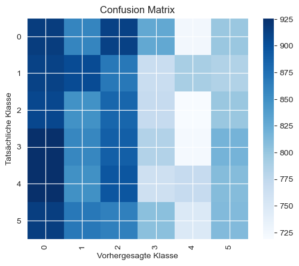
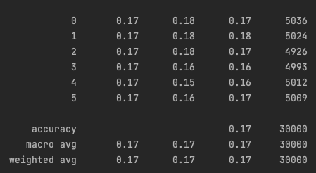

### PCA
PCA explained_variance_ratios:
[0.102183   0.10148124 0.10069052 0.10033698 0.09992652 0.09965502
 0.09957524 0.09928667 0.09847635 0.09838846]
None of the 10 features dominates. Dimensionality reduction is not possible.


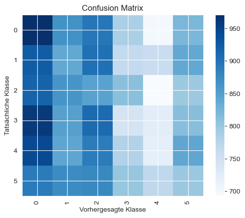
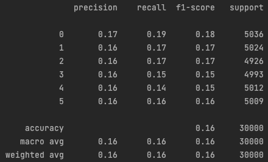

### LDA
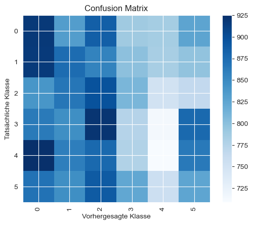
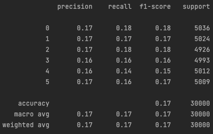
LDA could not lead to a significant better result.

### Deep Learning
#### Model 1
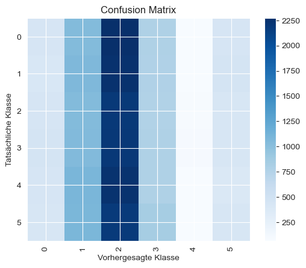
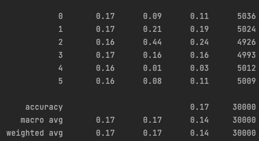

#### Model2
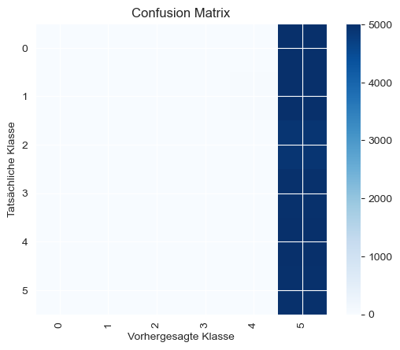
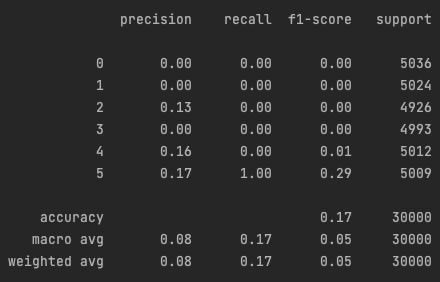

## Conclusion
None of the machine-learning-algorithms were abel to klassify the data. All of them had an accuracy value as guessing or worse.
The data is too similar. The methods deep-learning could noch extract signifikant features for classifikation.
Maybe the Data could be more preprocessed to find some correlation.